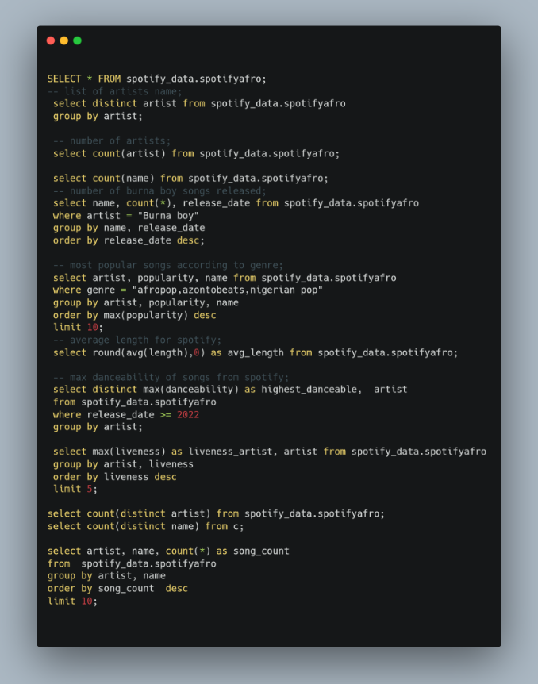

# Spotify-afrolist

## Introduction 
This is a SQL project on Afropop and Africa genre analysis from the spotify afrolist datasets. The project is to analyze and obtain imsights to tackle important questions.

## Problem statement

- How many songs did Burna boy release in that year
- How popular is a afropop and nigeria genre
- total number of artiste
- total number of songs
- songs with high danceability

## Skills Demonstrated
 The following Excel skill were used to analyze the datasets of spotify afrolist to give insight and answer crucial questions; 

 - WHERE statement; To filter the datasets in order to get our priority data
 - ORDER BY statement;  used to sort the result set of a query based on one or more columns. It allows you to arrange the rows in either ascending (ASC) or descending (DESC) order.
 - GROUP BY statement; s used to arrange identical data into groups based on the values of one or more columns. It is typically used in conjunction with aggregate functions to perform operations on each group of data.
 - SELECT statement; which is the almighty query in sql is used in retreiving data from database.
 - COUNT function; is used to count the number of rows that meet a specified condition in a table. It is commonly used in conjunction with the SELECT statement to retrieve information about the number of records in a table or a result set.
   
   
